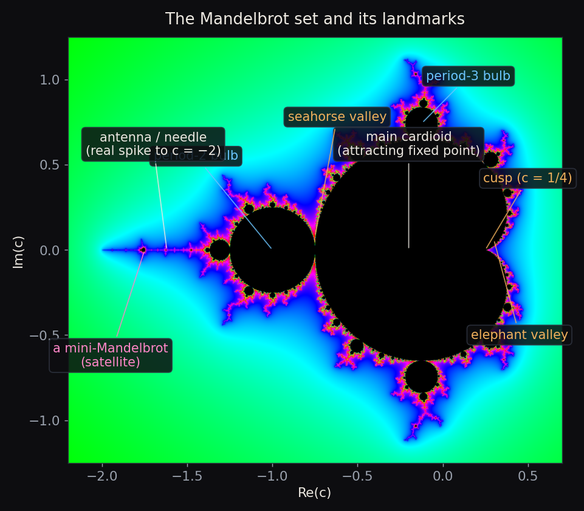
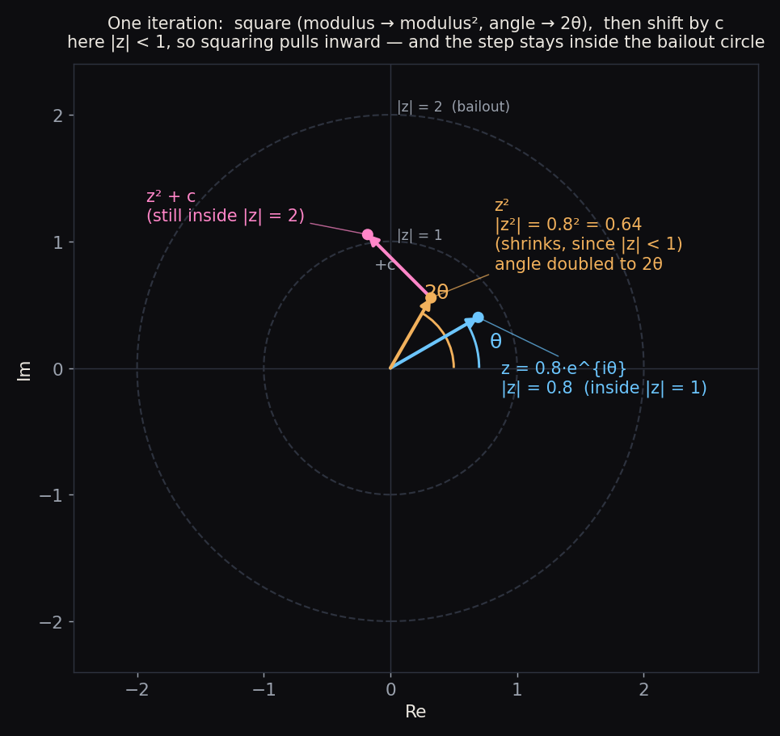
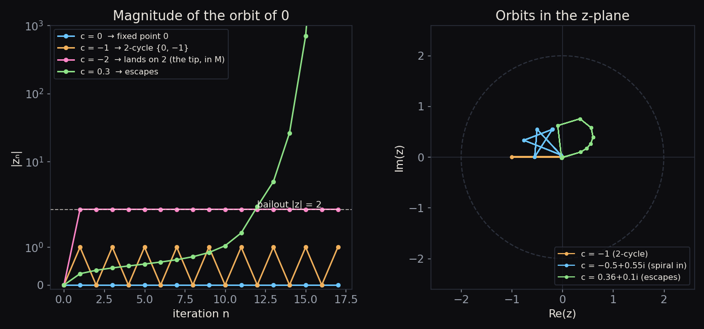
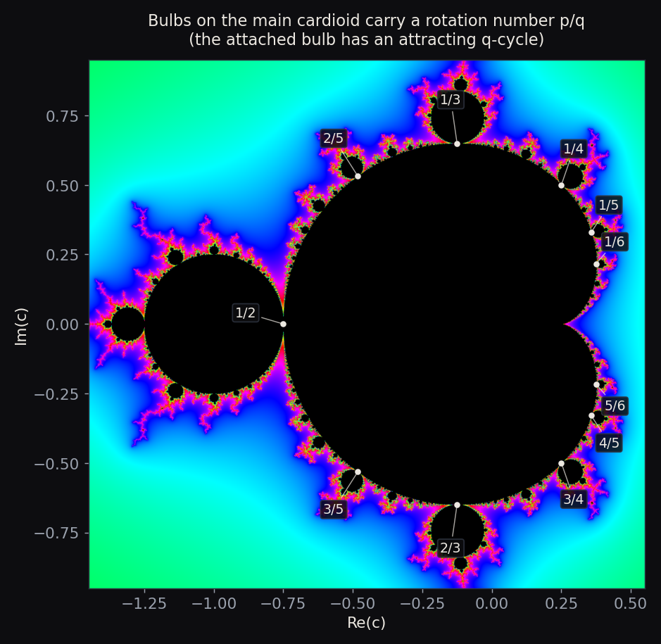
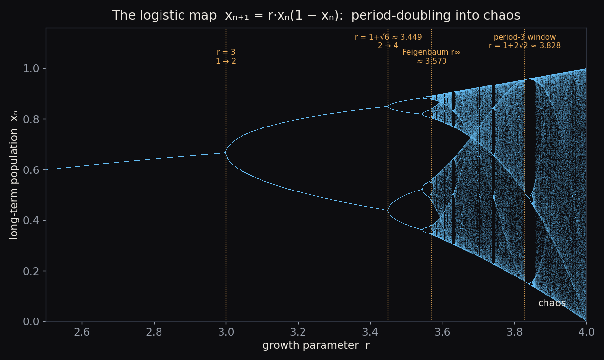
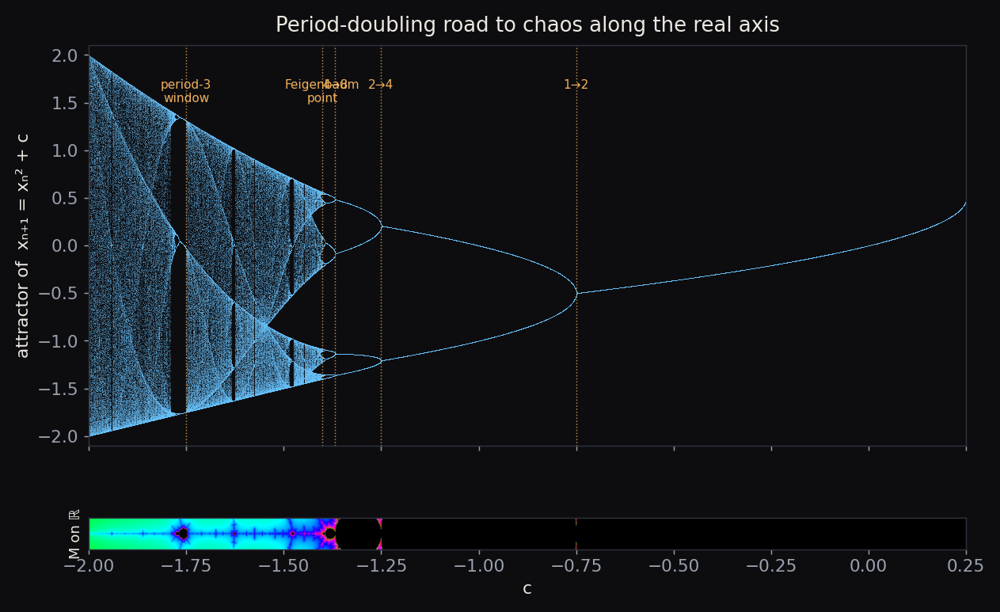
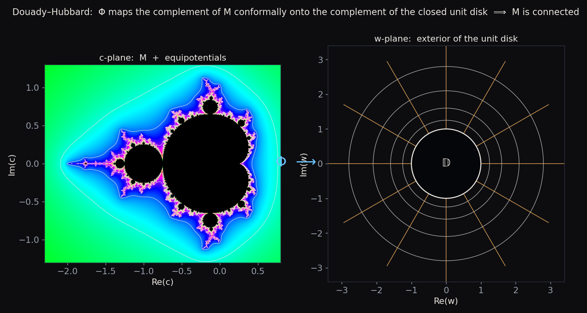
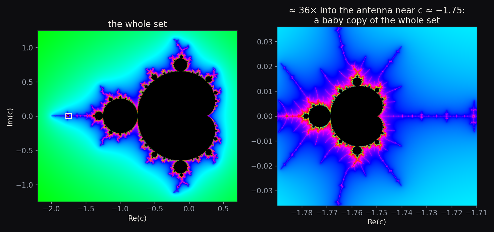
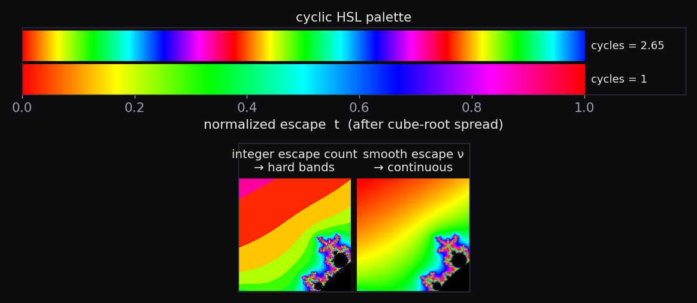

# The Mandelbrot Set

*A working draft for the gallery's “mathematics” page. Figures are generated by
[`make_figures.py`](make_figures.py). Math is written with `$…$` / `$$…$$` so it
renders with KaTeX once this becomes a web page.*

> **The whole object in one sentence.** Take the rule $z \mapsto z^2 + c$, start
> from $z = 0$, and ask a single yes/no question: *does the orbit stay bounded?*
> The set of complex numbers $c$ for which the answer is **yes** is the
> Mandelbrot set — and that one question carries an entire universe of structure.

**Contents**

1. [A short history](#1-a-short-history)
2. [Reading the picture](#2-reading-the-picture)
3. [The dynamics: squaring, escape, and periodicity](#3-the-dynamics-squaring-escape-and-periodicity)
4. [From iteration to the bifurcation diagram](#4-from-iteration-to-the-bifurcation-diagram)
5. [Why the set is connected — and the MLC conjecture](#5-why-the-set-is-connected--and-the-mlc-conjecture)
6. [Hyperbolic components and the density of hyperbolicity](#6-hyperbolic-components-and-the-density-of-hyperbolicity)
7. [Fun facts: self-similarity and fractal dimension](#7-fun-facts-self-similarity-and-fractal-dimension)
8. [How the viewer colors the set](#8-how-the-viewer-colors-the-set)
9. [How the viewer zooms so deep: perturbation theory](#9-how-the-viewer-zooms-so-deep-perturbation-theory)

---

## 1. A short history

The set is defined by the simplest nonlinear map imaginable — a square plus a
constant — yet nobody drew it until computers could. The first known picture is a
1978 rendering by **Robert Brooks** and **Peter Matelski**, who stumbled onto it
while studying Kleinian groups; it is a coarse ASCII-style plot, but the cardioid
and the main bulb are already there.

In 1980, **Benoit B. Mandelbrot**, working at IBM's Thomas J. Watson Research
Center, produced the first detailed computer visualizations while exploring the
*parameter space* of the quadratic family $z^2 + c$. His images revealed the
filaments, the satellites, and the endless boundary detail. Mandelbrot's 1982
book *The Fractal Geometry of Nature* turned “fractal” into a household word.

The rigorous mathematics came from **Adrien Douady** and **John H. Hubbard**.
Their *Étude dynamique des polynômes complexes* (the “Orsay notes,” 1982–1985)
laid the analytic foundation: they **proved the set is connected**, introduced the
machinery of *external rays* and the *uniformizing map*, organized the bulbs by
rotation number, and — crucially — **named the set after Mandelbrot**. It is
Douady who is usually credited with the name *“ensemble de Mandelbrot.”* Almost
everything in the sections below is, in one way or another, their framework.

---

## 2. Reading the picture

Formally,

$$
\mathcal{M} = \Big\{\, c \in \mathbb{C} \;:\; \text{the orbit } 0,\; f_c(0),\; f_c^2(0),\dots \text{ stays bounded} \,\Big\},
\qquad f_c(z) = z^2 + c .
$$

Everything you see is a *map of parameters* $c$, **not** a shape in the variable
$z$. Each pixel is a different dynamical system, colored by how its orbit behaves.

The landmarks worth knowing:

- **Main cardioid** — the big heart-shaped body. These are the $c$ for which
  $f_c$ has an *attracting fixed point*. Its boundary is the curve
  $c(\varphi) = \tfrac{1}{2}e^{i\varphi} - \tfrac{1}{4}e^{2i\varphi}$, with the
  **cusp** at $c = \tfrac14$.
- **Period-2 bulb** — the disk of radius $\tfrac14$ centered at $c=-1$. Here the
  attracting orbit is a 2-cycle.
- **Bulbs / decorations** — every bump on the cardioid is a *hyperbolic
  component* with its own attracting cycle; they are indexed by a rotation number
  $p/q$ (§3).
- **Antenna / needle** — the spike running left along the real axis, ending at the
  **tip** $c = -2$.
- **Seahorse valley** (the cleft near $c \approx -0.75$ where the cardioid meets
  the period-2 bulb) and **elephant valley** (the parade of trunks on the
  cardioid's right flank near $c \approx 0.28$) — informal names for two of the
  most photogenic neighborhoods.
- **Mini-Mandelbrots (satellites)** — tiny near-perfect copies of the whole set,
  scattered along the filaments (§7).

Two of these landmarks are more than scenery: the **main cardioid** and the
**period-2 bulb** are the first two regions whose dynamics we can pin down with a
formula. Their equations are derived in §3 — see
[*Attracting fixed points and the main cardioid*](#attracting-fixed-points-and-the-main-cardioid)
and [*The period-2 bulb, exactly*](#the-period-2-bulb-exactly).

---

## 3. The dynamics: squaring, escape, and periodicity

### The map, one step at a time

Write a complex number in polar form, $z = r\,e^{i\theta}$. Squaring it does two
very clean things:

$$
z^2 = r^2 \, e^{i\,2\theta} \qquad\Longrightarrow\qquad
\underbrace{r \to r^2}_{\text{modulus is squared}},\quad
\underbrace{\theta \to 2\theta}_{\text{angle is doubled}} .
$$

Then the map adds $c$, which simply **translates** the point. So each iteration of
$z \mapsto z^2 + c$ is *“square, then shift.”*

That picture explains a lot at a glance:

- Points with $r < 1$ are pulled **toward the origin** by squaring; points with
  $r > 1$ are flung **outward**, and fast (a number of modulus $10$ becomes
  $100$, then $10^4$…). The unit circle $r=1$ is the knife-edge, where squaring
  becomes the pure **angle-doubling map** $\theta \to 2\theta$ — already a
  textbook example of chaos.

### The escape criterion and the bailout radius 2

Once an orbit gets large, the squaring term overwhelms the shift and the orbit
runs away to infinity. Precisely: if $|z| > 2$ and $|z| \ge |c|$, then

$$
|f_c(z)| = |z^2 + c| \;\ge\; |z|^2 - |c| \;\ge\; |z|^2 - |z| \;=\; |z|\,(|z| - 1) \;>\; |z|,
$$

and since the growth factor $(|z|-1) > 1$ keeps compounding, $|z^n| \to \infty$.
Because every $c \in \mathcal{M}$ satisfies $|c| \le 2$, the rule is simply:

> **The orbit of $0$ escapes if and only if it ever exceeds $|z| = 2$.**

This is the **bailout radius** the renderer watches for, and the **escape time**
(how many steps until $|z| > 2$) is what gets turned into color in §8.

A few orbits make the boundary cases concrete:

- $c = 0$: the orbit is $0 \to 0 \to \cdots$ — a fixed point. Bounded.
- $c = -1$: $0 \to -1 \to 0 \to -1 \to \cdots$ — a **2-cycle**. Bounded (this is
  the center of the period-2 bulb).
- $c = -2$: $0 \to -2 \to 2 \to 2 \to \cdots$ — it lands *exactly* on $2$ and
  stays. Bounded, but only just: this is the **tip** of the antenna. Nudge it to
  $c = -2.01$ and the orbit escapes.
- $c = 0.3$: escapes immediately.

### Attracting fixed points and the main cardioid

What makes the *interior* of $\mathcal{M}$ interesting is **attracting orbits**.
The simplest are **fixed points** — values left unmoved by the map, $f_c(z)=z$:

$$
z^2 - z + c = 0 \qquad\Longrightarrow\qquad z_\pm = \frac{1 \pm \sqrt{1-4c}}{2} .
$$

So there are (generically) **two** fixed points. Whether one of them *attracts*
nearby orbits is decided by the **multiplier** $\lambda = f_c'(z) = 2z$:

$$
\lambda_\pm = 1 \pm \sqrt{1-4c}, \qquad \lambda_+ + \lambda_- = 2 .
$$

Because the two multipliers always **sum to $2$**, their average is $1$ — sitting
right on the unit circle — so they cannot both lie strictly inside it. **At most
one fixed point can be attracting** (call it the $\alpha$ point; the other,
$\beta$, is repelling and anchors the filaments).

The attracting fixed point exists exactly while $|\lambda| < 1$, and it loses
stability on the boundary $|\lambda| = 1$. Putting $\lambda = e^{i\varphi}$ and
using $c = z - z^2 = \tfrac{\lambda}{2} - \tfrac{\lambda^2}{4}$ traces out
precisely the **main cardioid** promised in §2:

$$
c(\varphi) = \frac{e^{i\varphi}}{2} - \frac{e^{2i\varphi}}{4}, \qquad 0 \le \varphi < 2\pi .
$$

Three points on it deserve names:

- **$c = 0$** — here $\lambda = 0$, so $z = 0$ is *super-attracting* (orbits
  collapse onto it at once). This is the **center**, or nucleus, of the cardioid.
- **$c = \tfrac14$** — here $1 - 4c = 0$, the two fixed points **collide** into one
  with $\lambda = 1$. This is the **cusp**: the rightmost point, where the fixed
  point is first born in a tangent (saddle-node) bifurcation.
- **$c = -\tfrac34$** — here $\lambda = -1$. The fixed point survives but turns
  marginally unstable, and this is exactly where the next region attaches.

### The period-2 bulb, exactly

Cross $c = -\tfrac34$ and the attracting fixed point hands off to an attracting
**2-cycle** — a pair $\{z_1, z_2\}$ with $f_c(z_1) = z_2$ and $f_c(z_2) = z_1$.
Both satisfy $f_c^2(z) = z$, which is a **degree-4** equation:

$$
f_c^2(z) - z = (z^2 + c)^2 + c - z = 0 .
$$

But the two *fixed* points also solve $f_c^2(z) = z$ (a fixed point is trivially a
2-cycle), so the fixed-point factor $z^2 - z + c$ **divides** this quartic. Pulling
it out leaves a tidy quadratic for the genuine 2-cycle:

$$
f_c^2(z) - z = \underbrace{(z^2 - z + c)}_{\text{fixed points}}\;
\underbrace{(z^2 + z + c + 1)}_{\text{the 2-cycle}},
\qquad
z_{1,2} = \frac{-1 \pm \sqrt{-3 - 4c}}{2} .
$$

The cycle's stability comes from the **chain rule around the loop**:
$\lambda_2 = (f_c^2)'(z_1) = f_c'(z_1)\,f_c'(z_2) = 4\,z_1 z_2$. Vieta's formula on
$z^2 + z + (c+1)$ gives $z_1 z_2 = c + 1$, so

$$
\lambda_2 = 4(c + 1), \qquad\text{attracting} \iff |\lambda_2| < 1 \iff |c + 1| < \tfrac14 .
$$

That inequality is exactly the **disk of radius $\tfrac14$ centered at $c = -1$** —
the **period-2 bulb**. It is super-attracting at its center $c = -1$
($\lambda_2 = 0$) and rooted at $c = -\tfrac34$ ($\lambda_2 = 1$), meeting the
cardioid right where we left off.

### Higher periods

The same idea climbs. Period-$k$ points solve $f_c^k(z) = z$, a polynomial of
degree $2^k$. Cycles whose period *divides* $k$ also solve it and factor out,
leaving the *primitive* period-$k$ points. Period 3, for instance, gives degree
$2^3 = 8$; removing the two fixed points leaves degree $6$ — the **two** distinct
3-cycles. A cycle's multiplier is again the product around the loop,
$\lambda_k = \prod_i f_c'(z_i) = 2^k\, z_1 z_2 \cdots z_k$, and the attracting
region is $|\lambda_k| < 1$, centered at the **super-attracting** parameter where
the critical point $0$ itself lands on the cycle (i.e. $f_c^k(0) = 0$).

Unlike periods 1 and 2, there is **no closed form** for $k \ge 3$ — the degree
$2^k$ explodes — so those cycles, and the centers of their bulbs and
mini-Mandelbrots, are found numerically. Each such attracting region is one of the
bulbs studding the set.

### Periodicity, the period-2 bulb, and the rational bulbs

These higher-period bulbs hang off the main cardioid in a strikingly orderly way.
A bulb attaches at the cardioid point whose fixed-point multiplier is a **root of
unity**, $\lambda = e^{2\pi i\, p/q}$, and the bulb growing there carries an
attracting **period-$q$** cycle. The fraction $p/q$ is the bulb's **rotation
number** — it even tells you how the $q$ filaments of its antenna are permuted at
each step.

Two beautiful consequences:

- The biggest bulb is $1/2$ — the **period-2 bulb** at $c=-1$. Next come $1/3$ and
  $2/3$ (period 3), then $1/4, 2/5, \dots$ — smaller as $q$ grows.
- Between the bulbs $p_1/q_1$ and $p_2/q_2$, the **largest** bulb in the gap sits
  at the **Farey mediant** $\dfrac{p_1 + p_2}{q_1 + q_2}$. The rationals organize
  the entire boundary.

---

## 4. From iteration to the bifurcation diagram

### A short detour: the logistic map

Before the link to chaos theory, meet its most famous toy model. The **logistic
map**

$$
x_{n+1} = r\, x_n(1 - x_n), \qquad x_n \in [0, 1],
$$

was popularized by Robert May (1976) as a model of a population that grows at rate
$r$ but is held back by crowding. Iterate it — feed each year's population back in
— and ask what value (or values) the population *settles into* as $n \to \infty$.
The answer, plotted against $r$, is one of the iconic pictures of nonlinear
science.

- For $1 < r < 3$ there is a single attracting **fixed point** $x^{*} = 1 - 1/r$
  (with multiplier $2 - r$): the population settles to one value.
- At **$r = 3$** the multiplier reaches $-1$ and the fixed point **period-doubles**
  — the population now alternates between **two** values. This is the **first**
  bifurcation.
- That 2-cycle is stable until **$r = 1 + \sqrt{6} \approx 3.449$**, where it
  doubles again to a **4-cycle** — the **second** bifurcation. Then $8, 16, 32,
  \dots$, the gaps shrinking by the universal **Feigenbaum constant**
  $\delta \approx 4.6692$ and accumulating at $r_\infty \approx 3.5699$.
- Past $r_\infty$ the orbit never repeats — **chaos** — but the chaos is shot
  through with **windows** of sudden order, where a stable cycle reappears out of
  nowhere. The widest is the **period-3 window** opening at
  $r = 1 + 2\sqrt{2} \approx 3.828$ (its existence is the famous *“period three
  implies chaos,”* Li & Yorke 1975). At $r = 4$ the map is fully chaotic.

### The Mandelbrot set on the real axis is the *same* diagram

Now restrict the Mandelbrot map $z \mapsto z^2 + c$ to **real** $c$ and real $z$. A
real quadratic is a real quadratic: $x \mapsto x^2 + c$ and the logistic map are
**affinely conjugate** — identical dynamics in different coordinates. The parameter
dictionary is exact:

$$
c = \frac{r}{2} - \frac{r^2}{4},
\qquad\text{equivalently}\qquad
r = 1 + \sqrt{1 - 4c}.
$$

It carries the logistic range $r \in [1, 4]$ onto $c \in [-2,\ \tfrac14]$ —
**precisely the real slice of the Mandelbrot set.** So the spike of $\mathcal{M}$
along the real axis *is* the logistic bifurcation diagram, re-drawn in the
parameter $c$.

Every landmark maps straight over:

| logistic $r$ | Mandelbrot $c$ | event |
|---|---|---|
| $3$ | $-\tfrac34$ | fixed point → 2-cycle (cardioid → period-2 bulb) |
| $1+\sqrt6 \approx 3.449$ | $-\tfrac54$ | 2-cycle → 4-cycle |
| $r_\infty \approx 3.570$ | $c_\infty \approx -1.401$ | Feigenbaum point (onset of chaos) |
| $1+2\sqrt2 \approx 3.828$ | $-1.75$ | period-3 window |
| $4$ | $-2$ | fully chaotic (the antenna tip) |

The rows of bulbs marching down the antenna are exactly the period-$2^k$ cascade,
drawn in the complex plane.

### Do the windows correspond to the satellite bulbs?

**Yes — they are the very same objects.** A periodic window in the 1-D logistic
diagram and a satellite **mini-Mandelbrot** in the 2-D plane don't merely
“correspond”: the window is the **real cross-section** of the satellite.

Here is why. Inside a window, three things happen in sequence — a **tangent
(saddle-node) bifurcation** abruptly creates an attracting period-$k$ cycle; that
cycle runs its **own period-doubling cascade**; then it dissolves back into chaos.
Read in the complex plane, that is exactly the anatomy of a mini-Mandelbrot: the
tangent bifurcation is the **cusp of the satellite's little cardioid**, the
sub-cascade is the satellite's own string of **bulbs**, and the window's chaos is
the satellite's own antenna. The period-3 window at $r \approx 3.828$ *is* the big
mini-Mandelbrot at $c = -1.75$.

So **each window is a miniature copy of the whole bifurcation diagram**, because
each satellite is a miniature copy of the whole Mandelbrot set — the phenomenon of
**renormalization** (Douady–Hubbard), and the same self-similarity we return to in
§7. The only real difference is dimension: the satellite is the full 2-D object
adrift in the complex plane, while its window is just the 1-D slit where it happens
to cross the real axis.

---

## 5. Why the set is connected — and the MLC conjecture

Looking at the picture, you might guess the satellites are separate islands. They
are **not**: in 1982 **Douady and Hubbard proved $\mathcal{M}$ is connected** —
every piece is joined to the main body by filaments, some far too thin to see.

### The uniformizing map

Their proof is a gem. For $c$ *outside* $\mathcal{M}$, the map $f_c$ is, near
infinity, conformally the same as the pure squaring map $w \mapsto w^2$; the change
of coordinates is the **Böttcher map** $\varphi_c$. Evaluating it at the critical
value defines

$$
\Phi:\ \mathbb{C}\setminus\mathcal{M}\ \longrightarrow\ \mathbb{C}\setminus\overline{\mathbb{D}},
\qquad
\Phi(c) = \varphi_c(c) = \lim_{n\to\infty}\big(f_c^{\,n}(0)\big)^{1/2^n},
$$

and Douady–Hubbard show $\Phi$ is a **conformal isomorphism**: it maps the outside
of the Mandelbrot set one-to-one and angle-preservingly onto the outside of the
**closed unit disk**.

Because the complement of $\mathcal{M}$ is conformally just the exterior of a disk
— which is connected and has no holes — **$\mathcal{M}$ itself must be connected**
(and “full,” i.e. it traps no bubbles of exterior). The same map hands us two
tools the renderer quietly uses:

- the **potential** (Green's function) $G(c) = \log|\Phi(c)|$, whose level sets are
  the **equipotentials** drawn above (and which the smooth escape-time coloring of
  §8 approximates);
- the **external rays** $\arg \Phi(c) = 2\pi\theta$, which land on the boundary and
  give $\partial\mathcal{M}$ its combinatorial address book.

### MLC

The big open question is **MLC — “the Mandelbrot set is Locally Connected.”** If
true, Carathéodory's theorem says the inverse map $\Phi^{-1}$ extends *continuously*
to the boundary circle, so **every external ray lands at a well-defined point** and
$\mathcal{M}$ becomes homeomorphic to an explicit combinatorial model (Douady's
“pinched disk”). In short, MLC would give a **complete topological blueprint** of
the set — and, as a bonus, it would **imply the density of hyperbolicity** (§6) in
the quadratic family. **Jean-Christophe Yoccoz** proved MLC at every
finitely-renormalizable parameter; the infinitely-renormalizable case remains open.
It is one of the central problems of complex dynamics.

---

## 6. Hyperbolic components and the density of hyperbolicity

A **hyperbolic component** is a connected piece of the *interior* of $\mathcal{M}$
on which $f_c$ has an attracting cycle of some fixed period. The cardioid (period
1), the bulbs (period $q$), and the little cardioid of *every* mini-Mandelbrot are
all hyperbolic components. Each one is, internally, as tidy as a disk: the
**multiplier map** $\lambda : U \to \mathbb{D}$ is a conformal isomorphism, with

- a **center** where $\lambda = 0$ — the *superattracting* parameter, where the
  critical orbit is exactly periodic (the “nucleus” the deep-zoom films aim for);
- a **root** where $\lambda = 1$ — the parabolic point where the component is
  bolted onto its parent.

### The density of hyperbolicity conjecture

Here is the picture to hold in your head. $\mathcal{M}$ is one connected object;
its bulbs and satellites are all stitched together by filaments; the **interior**
is (conjecturally) *nothing but* these hyperbolic components — regions of calm,
attracting dynamics — while all the chaos lives on the razor-thin **boundary**
$\partial\mathcal{M}$.

That “nothing but” is the **density of hyperbolicity conjecture** (Fatou's
conjecture): the parameters with an attracting cycle are **dense** in the whole
parameter plane. A set is *dense* when every point is a limit of it — so this says
that **arbitrarily close to *any* $c$**, even one buried in the chaotic boundary,
there is a nearby $c'$ whose dynamics is simple and attracting. Equivalently: the
interior of $\mathcal{M}$ has no exotic (“queer,” non-hyperbolic) components.

If it holds, the “computable, well-behaved” maps are as common as can be, and the
quadratic family is, in a precise sense, *tame*. It is **proved for real
parameters** (Graczyk–Świątek and Lyubich, 1997) but **open over $\mathbb{C}$** —
and it would follow from MLC.

---

## 7. Fun facts: self-similarity and fractal dimension

**Mini-Mandelbrots everywhere.** Zoom into the filaments and you keep finding tiny,
slightly-distorted copies of the entire set.

The set is not *exactly* self-similar like a Koch snowflake; it is
**quasi-self-similar**, and the copies are explained by Douady–Hubbard's theory of
**renormalization**. Near a *Misiurewicz point* (a preperiodic parameter) the set
is even asymptotically self-similar — and, by a theorem of **Tan Lei**, locally
looks like the *Julia set* at that same $c$.

**A boundary of dimension 2.** The crinkliness has a number attached: in 1991
**Mitsuhiro Shishikura** proved the **Hausdorff dimension of $\partial\mathcal{M}$
is exactly $2$** — the maximum possible for a curve in the plane. The boundary is,
in a rigorous sense, as rough as a one-dimensional thing can be.

A few more:

- $\mathcal{M}$ is **compact** and sits inside the disk $|c| \le 2$.
- Its **area** is finite, $\approx 1.5065$ (numerically).
- It is **connected** (proved) and **conjectured locally connected** (MLC).
- Despite the dimension-2 boundary, that boundary is conjectured to have
  Lebesgue **measure zero** — all the “area” is in the bulbs.

---

## 8. How the viewer colors the set

Points *inside* $\mathcal{M}$ are painted **black**. Points outside are colored by
**how fast they escaped** — but with two refinements that make the bands melt into
smooth gradients.

**Smooth escape time.** A raw integer escape count produces hard contour bands
(left, below). The renderer instead uses the **normalized** (renormalized) escape
count, which interpolates *between* iterations:

$$
\nu \;=\; n + 1 - \log_2\!\big(\log |z_n|\big),
$$

evaluated at the first $n$ with $|z_n|$ past the bailout. (This $\nu$ is essentially
the escape **potential** $G(c)$ from §5, which is why the coloring traces the
equipotentials.)

**Cube-root spread + cyclic hue.** Most exterior pixels escape *quickly*, so the
small-$\nu$ values are crowded; the renderer spreads them out with a cube root and
then wraps a cyclic hue around them:

$$
t = \left(\frac{\nu}{\text{maxIter}-1}\right)^{1/3},
\qquad
\text{hue} = \operatorname{frac}\!\big(t \cdot \texttt{cycles}\big),
$$

mapped through a six-segment HSL→RGB wheel. The **`cycles`** control sets how many
times the palette repeats from the boundary outward — the knob behind the candy
striping in the deep-zoom films. (This exact mapping lives in the viewer's
`colorMap`, the CLI's `colorize`, and the landing-page hero shader, so all three
agree pixel-for-pixel.)

---

## 9. How the viewer zooms so deep: perturbation theory

Naively, every pixel iterates its own $c$. That breaks down twice as you zoom in:
the arithmetic gets slow at high precision, **and** — more subtly — around zoom
$\sim 10^{14}$ the per-pixel coordinate, computed in ordinary `double`, can no
longer tell neighboring pixels apart, so the image collapses.

**Perturbation theory** fixes both at once. Iterate **one** high-precision
**reference orbit** $Z_n$ from the view center $C$, and write every other pixel as a
small deviation $z_n = Z_n + \delta_n$. Subtracting the two recurrences, the
per-pixel part evolves in fast ordinary precision:

$$
\delta_{n+1} \;=\; 2\,Z_n\,\delta_n + \delta_n^2 + \delta c,
\qquad \delta c = c - C .
$$

Only $C$ and its orbit $Z_n$ need many digits; the offsets $\delta$ stay tiny and
double precision is plenty. This removes the $10^{14}$ wall and is dramatically
faster than per-pixel high precision.

The full derivation — including the escape test in perturbed coordinates, glitch
detection and reference **rebasing**, and the (deferred) **series approximation** —
is written up separately in **[`../perturbation.md`](../perturbation.md)**.

---

*Draft ends. Sources to cite when finalized: Douady–Hubbard, “Étude dynamique des
polynômes complexes” (1982–85); Shishikura, “The Hausdorff dimension of the
boundary of the Mandelbrot set” (Ann. Math. 1998); Lyubich and Graczyk–Świątek on
real hyperbolicity (1997); Yoccoz on MLC. Numbers (area, Feigenbaum constant)
should get precise references.*
